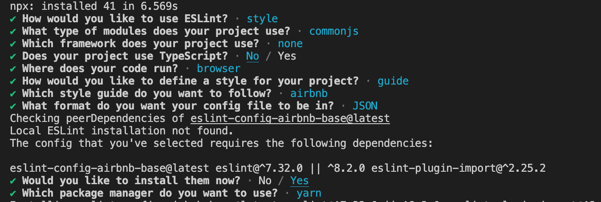

If you have a nodejs micro-service or app that you would like to configure with eslint you can simple do it with a few commands in the terminal. Start with running the below command.

```javascript
npm init @eslint/config
```

Above command will prompt you with a few questions, selects the options as selected in the below image.



Your *package.json* should be updated with the following packages in devDependencies:

```javascript
"devDependencies": {
  "eslint": "^7.32.0 || ^8.2.0",
  "eslint-config-airbnb-base": "^15.0.0",
  "eslint-plugin-import": "^2.25.2"
}
```

We are using [airbnb-base](https://www.npmjs.com/package/eslint-config-airbnb-base) which internally uses and auto configs [eslint-plugin-import](https://github.com/import-js/eslint-plugin-import) (you can override the options for import by simple adding the configs in your .eslintrc file)

Below is an example of how to override the eslint options for both the *eslint-plugin-import* and also a [eslint rule](https://eslint.org/docs/latest/rules) (rules overriden are *semi* , *import/no-unresolved*, *import/extensions*):-

```javascript
{
    "env": {
        "browser": true,
        "commonjs": true,
        "es2021": true
    },
    "extends": [
        "airbnb-base"
    ],
    "overrides": [
    ],
    "plugins": [
        "import"
    ],
    "parserOptions": {
        "ecmaVersion": "latest",
        "sourceType": "module"
    },
    "rules": {
        "semi": "off",
        "import/no-unresolved": ["off", { "commonjs": true, "caseSensitive": true }],
        "import/extensions": "off"
    }
}
```

Hope this helps you get your project configured with eslint. Happy coding. 

#### References :-

[Rules for eslint-plugin-import](https://github.com/import-js/eslint-plugin-import#rules)

*todo* :- *write about how to add a npm script in package.json for running linting (eg eslint ./src/ --ignore-path .gitignore --ignore-pattern internals/scripts)*