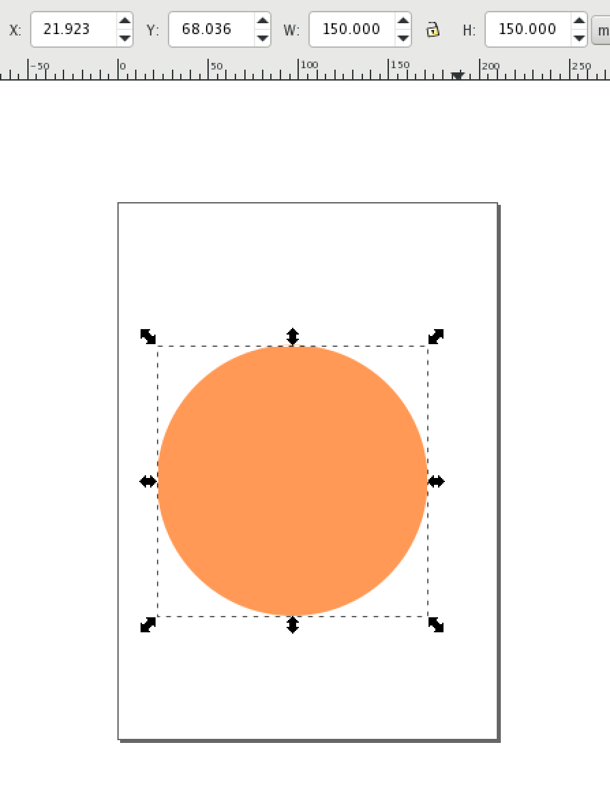
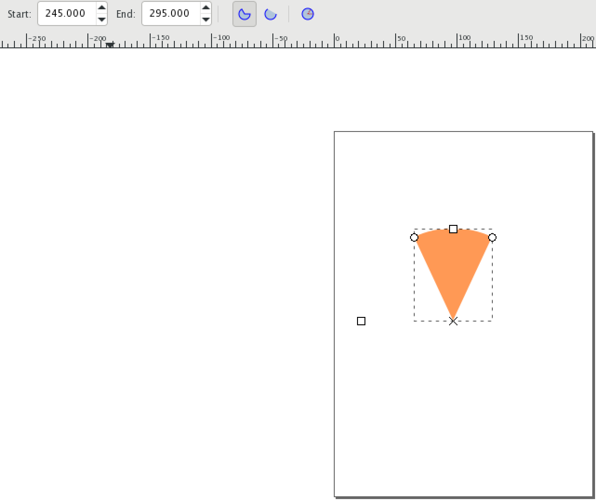

Heres a quick demostration on how to create a pizza shape in inkscape.
<!-- more -->
open inkscape , select the circle tool and draw circle while pressing SHIFT + CMD (on mac), if you still get an uneven circle you can adjust the height and width in the H and W boxes. see below.

Now select the circle tool and you should see the start and end input boxes, in the start box enter 270-25=245 and in the end box enter 270+25=295. Voila ! now you should have a perfect pizza shape. see below

Thats it for this quick tut. 

P.S. this is a bit bland but our objective ultimatly is to create a pizza svg animation and this is part of the  building blocks. stay tuned.