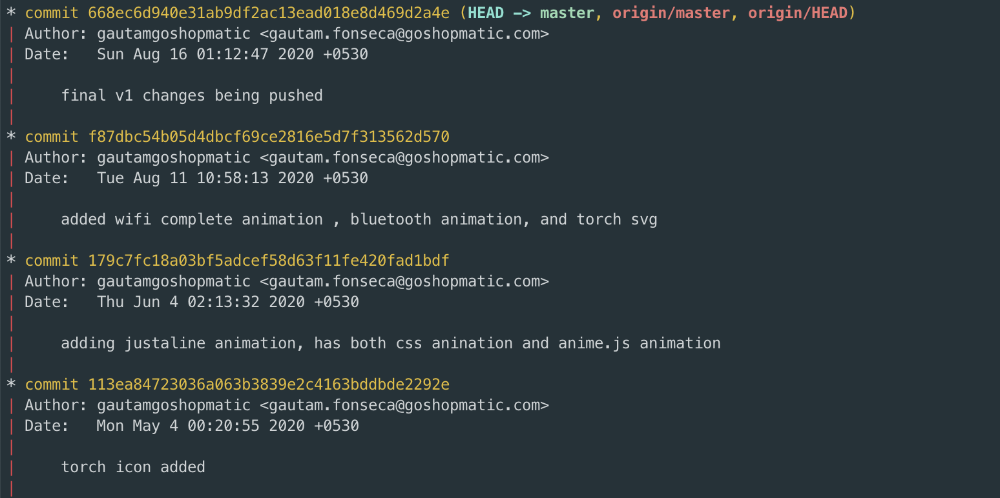

In this overly simplistic we're going to add 2 simple alias for a couple of common git log options.
<!-- more -->

Firstly (keep in mind we use the `--graph` option below because the output is slightly more clear then just a plan `git log`), 

```javascript
git log --graph

// instead of typing out this command, lets add an alias
git config --global alias.lg "log --graph"

// Now you can use the command like so
git lg
```




lastly,

```javascript
git log --oneline

// instead of typing out this command, lets add an alias
git config --global alias.lo "log --oneline"

// Now you can use the command like so
git lo
```

