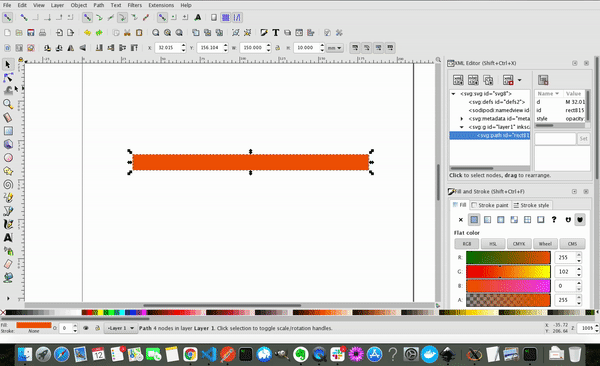

How to know the starting node and the direction of a svg path ? <!-- more --> Simple select the path and click on `Tab` once. the first node to be selected is the first node and as far is direction is concerned.

Another way to know the direction of the path is , select the path and `Extensions` → `Visualize Path` → `Number Nodes`. Then, Select apply.

Hope that helps. Cheers !
